# LittleProxy Request Handling Architecture

This document explains with detailed diagrams how LittleProxy handles HTTP/HTTPS requests.

## Architecture Overview

## Main Class Diagram

## HTTP Request Lifecycle (Non-CONNECT)

```mermaid
sequenceDiagram
    autonumber
    actor Client
    participant C2P as ClientToProxyConnection
    participant Filters as HttpFilters
    participant P2S as ProxyToServerConnection
    participant CF as ConnectionFlow
    participant Target as Target Server

    Note over Client,Target: Standard HTTP Request (GET/POST/...)
    
    Client->>C2P: HTTP Request
    activate C2P
    
    C2P->>Filters: clientToProxyRequest(request)
    alt Short-circuit response
        Filters-->>C2P: HttpResponse (short-circuit)
        C2P->>C2P: respondWithShortCircuitResponse()
        C2P-->>Client: Filtered Response
    else Continue processing
        Filters-->>C2P: null (continue)
        
        C2P->>C2P: identifyHostAndPort()
        C2P->>C2P: find/reuse ProxyToServerConnection
        
        C2P->>Filters: proxyToServerRequest(request)
        Filters-->>C2P: null (continue)
        
        C2P->>P2S: write(request, filters)
        activate P2S
        
        alt Existing connection
            P2S->>Target: Send request
        else New connection
            P2S->>CF: initializeConnectionFlow()
            CF->>CF: start() → ConnectChannel
            CF->>Target: TCP Connection
            CF->>CF: succeed()
            CF-->>P2S: connectionSucceeded()
            P2S->>Target: Send request
        end
        
        P2S->>Filters: proxyToServerRequestSending()
        P2S->>Filters: proxyToServerRequestSent()
        deactivate P2S
        
        Target-->>P2S: HTTP Response
        activate P2S
        P2S->>Filters: serverToProxyResponseReceiving()
        P2S->>Filters: serverToProxyResponse(response)
        Filters-->>P2S: modified response
        
        P2S->>C2P: respond(filters, request, response, object)
        deactivate P2S
        
        C2P->>Filters: proxyToClientResponse(response)
        Filters-->>C2P: final response
        C2P->>C2P: modifyResponseHeaders()
        C2P-->>Client: Final Response
        deactivate C2P
        
        P2S->>Filters: serverToProxyResponseReceived()
    end
```

## CONNECT Request Lifecycle (HTTPS Tunneling)

```mermaid
sequenceDiagram
    autonumber
    actor Client
    participant C2P as ClientToProxyConnection
    participant P2S as ProxyToServerConnection
    participant CF as ConnectionFlow
    participant Target as Target Server

    Note over Client,Target: HTTPS Tunneling (without MITM)
    
    Client->>C2P: CONNECT host:443
    activate C2P
    C2P->>C2P: doReadHTTPInitial()
    C2P->>P2S: create() + write(connectRequest)
    activate P2S
    
    P2S->>CF: initializeConnectionFlow()
    CF->>CF: start()
    
    Note right of CF: ConnectionFlow Steps
    CF->>Target: 1. ConnectChannel (TCP)
    CF->>Target: 2. StartTunneling (tunnel mode)
    
    CF-->>C2P: RespondCONNECTSuccessful
    C2P-->>Client: 200 Connection established
    
    CF->>C2P: StartTunneling
    CF->>CF: succeed()
    CF-->>P2S: connectionSucceeded()
    deactivate P2S
    
    Note over Client,Target: Active Tunnel - raw data
    
    Client->>C2P: Raw SSL/TLS data
    C2P->>P2S: readRaw() → write()
    P2S->>Target: Raw SSL/TLS data
    
    Target-->>P2S: Raw SSL/TLS data
    P2S->>C2P: readRaw() → write()
    C2P-->>Client: Raw SSL/TLS data
    
    deactivate C2P
```

## Connection Flow (with MITM)

```mermaid
flowchart TB
    subgraph "ConnectionFlow Steps"
        START(["Start"]) --> CONNECT["1️⃣ ConnectChannel<br/>TCP Connection"]
        CONNECT --> CHAIN_PROXY{"Chained Proxy ?"}
        
        CHAIN_PROXY -->|"Yes - HTTP"| HTTP_PROXY["HTTPCONNECTWithChainedProxy"]
        CHAIN_PROXY -->|"Yes - SOCKS4"| SOCKS4["SOCKS4CONNECTWithChainedProxy"]
        CHAIN_PROXY -->|"Yes - SOCKS5"| SOCKS5["SOCKS5InitialRequest<br/>→ SOCKS5SendPasswordCredentials<br/>→ SOCKS5CONNECTRequest"]
        CHAIN_PROXY -->|"No"| CHECK_CONNECT{"CONNECT Request ?"}
        
        HTTP_PROXY --> CHECK_CONNECT
        SOCKS4 --> CHECK_CONNECT
        SOCKS5 --> CHECK_CONNECT
        
        CHECK_CONNECT -->|"No"| END_SUCCESS(["Success<br/>AWAITING_INITIAL"])
        
        CHECK_CONNECT -->|"Yes"| MITM_CHECK{"MITM Enabled ?"}
        
        MITM_CHECK -->|"Yes"| ENCRYPT_SERVER["EncryptChannel<br/>(SSL to server)"]
        ENCRYPT_SERVER --> RESPOND_OK1["RespondCONNECTSuccessful<br/>200 to client"]
        RESPOND_OK1 --> ENCRYPT_CLIENT["MitmEncryptClientChannel<br/>(SSL to client)"]
        ENCRYPT_CLIENT --> END_MITM(["MITM Success<br/>AWAITING_INITIAL"])
        
        MITM_CHECK -->|"No"| TUNNEL_SERVER["StartTunneling<br/>(server side)"]
        TUNNEL_SERVER --> RESPOND_OK2["RespondCONNECTSuccessful<br/>200 to client"]
        RESPOND_OK2 --> TUNNEL_CLIENT["StartTunneling<br/>(client side)"]
        TUNNEL_CLIENT --> END_TUNNEL(["Tunnel Success<br/>Raw bytes mode"])
    end
    
    style START fill:#90EE90
    style END_SUCCESS fill:#90EE90
    style END_MITM fill:#FFD700
    style END_TUNNEL fill:#87CEEB
```

## Netty Pipeline - Client Side (Inbound)

```mermaid
flowchart LR
    subgraph "ClientToProxy Pipeline"
        direction LR
        IN["📥 Inbound"]
        OUT["📤 Outbound"]
        
        IN --> BYTES_READ["bytesReadMonitor<br/>📊 Read stats"]
        BYTES_READ --> BYTES_WRITE["bytesWrittenMonitor<br/>📊 Write stats"]
        BYTES_WRITE --> ENCODER["HttpResponseEncoder<br/>📤 Encode responses"]
        
        PROXY_DEC["HAProxyMessageDecoder<br/>🌐 Proxy Protocol"]
        DECODER["HttpRequestDecoder<br/>📥 Decode requests"]
        AGG["HttpObjectAggregator<br/>📦 Buffering (opt)"]
        REQ_MON["requestReadMonitor<br/>📊 Request stats"]
        RES_MON["responseWrittenMonitor<br/>📊 Response stats"]
        IDLE["IdleStateHandler<br/>⏱️ Timeout"]
        HANDLER["ClientToProxyConnection<br/>🎯 Main handler"]
        
        ENCODER --> PROXY_DEC
        PROXY_DEC --> DECODER
        DECODER --> AGG
        AGG --> REQ_MON
        REQ_MON --> RES_MON
        RES_MON --> IDLE
        IDLE --> HANDLER
        HANDLER --> OUT
    end
    
    style HANDLER fill:#FFD700,stroke:#FF8C00,stroke-width:3px
```

## Netty Pipeline - Server Side (Outbound)

```mermaid
flowchart LR
    subgraph "ProxyToServer Pipeline"
        direction LR
        IN["📥 Inbound"]
        OUT["📤 Outbound"]
        
        IN --> BYTES_READ["bytesReadMonitor<br/>📊 Read stats"]
        BYTES_READ --> BYTES_WRITE["bytesWrittenMonitor<br/>📊 Write stats"]
        BYTES_WRITE --> TRAFFIC["GlobalTrafficShapingHandler<br/>🚦 Throttling (opt)"]
        
        TRAFFIC --> PROXY_ENC["HAProxyMessageEncoder<br/>🌐 Proxy Protocol"]
        PROXY_ENC --> ENCODER["HttpRequestEncoder<br/>📤 Encode requests"]
        DECODER["HeadAwareHttpResponseDecoder<br/>📥 Decode responses"]
        AGG["HttpObjectAggregator<br/>📦 Buffering (opt)"]
        RES_MON["responseReadMonitor<br/>📊 Response stats"]
        REQ_MON["requestWrittenMonitor<br/>📊 Request stats"]
        IDLE["IdleStateHandler<br/>⏱️ Timeout"]
        HANDLER["ProxyToServerConnection<br/>🎯 Main handler"]
        
        ENCODER --> DECODER
        DECODER --> AGG
        AGG --> RES_MON
        RES_MON --> REQ_MON
        REQ_MON --> IDLE
        IDLE --> HANDLER
        HANDLER --> OUT
    end
    
    style HANDLER fill:#87CEEB,stroke:#4682B4,stroke-width:3px
```

## Connection State Machine

## Filter Chain (HttpFilters)

## Chained Proxy Management

## Backpressure Management

## Key Components Summary

| Component | Role | File |
|-----------|------|------|
| **DefaultHttpProxyServer** | Entry point, bootstrap, configuration | `DefaultHttpProxyServer.java` |
| **ClientToProxyConnection** | Manages incoming client connections | `ClientToProxyConnection.java` |
| **ProxyToServerConnection** | Manages outgoing server connections | `ProxyToServerConnection.java` |
| **ConnectionFlow** | Orchestration of connection steps | `ConnectionFlow.java` |
| **ConnectionFlowStep** | Individual step in the connection flow | `ConnectionFlowStep.java` |
| **HttpFilters** | Interface for filtering/modifying requests/responses | `HttpFilters.java` |
| **ProxyConnection** | Abstract base class for connections | `ProxyConnection.java` |
| **ServerGroup** | Netty thread pool management | `ServerGroup.java` |

## Key Architecture Points

1. **Separation of Concerns**: The [`ClientToProxyConnection`](src/main/java/org/littleshoot/proxy/impl/ClientToProxyConnection.java:88) class manages the client side, while [`ProxyToServerConnection`](src/main/java/org/littleshoot/proxy/impl/ProxyToServerConnection.java:104) manages the server side.

2. **Connection Reuse**: Only one [`ProxyToServerConnection`](src/main/java/org/littleshoot/proxy/impl/ProxyToServerConnection.java:104) per host:port is maintained and reused for HTTP requests.

3. **Tunnel Mode**: For CONNECT requests (HTTPS), HTTP encoders/decoders are removed and data passes through in raw bytes mode.

4. **MITM (Man-In-The-Middle)**: Allows decrypting HTTPS traffic by acting as an SSL server on the client side and SSL client on the server side.

5. **Chained Proxies**: Support for HTTP, SOCKS4, and SOCKS5 with automatic fallback mechanism.

6. **Filters**: Extensible filter chain allowing modification of requests/responses at different stages.

7. **Backpressure**: Saturation management mechanism to prevent memory overload.
